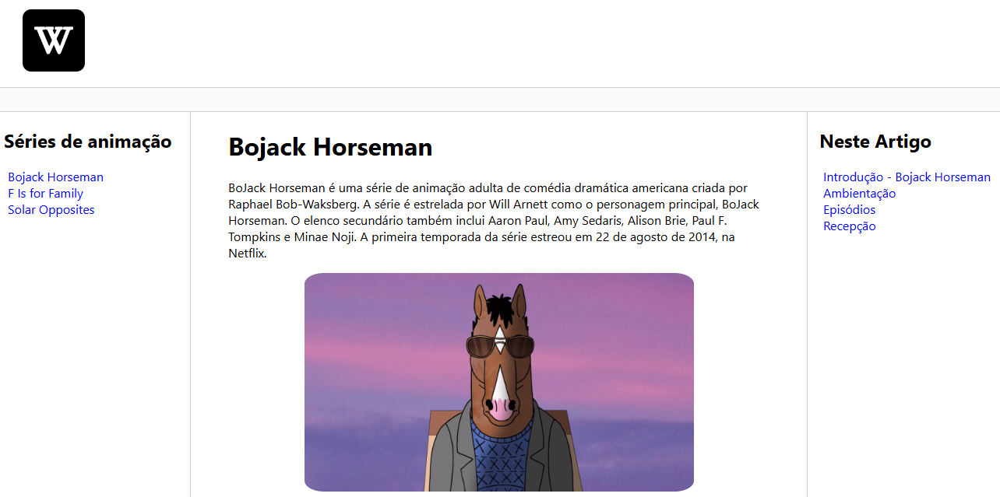

# 💻 Desafio do módulo 3 - HTML II | Ampliando Conhecimentos

**Título:** Recriando Wikipedia, com um layout melhor

## 📝 Objetivo
Este desafio consiste em treinar a construção da estrutura do site, e também aplicar conhecimentos adiquiridos sobre semântica e acessibilidade.

### ✅ Desenvolvimento
Elaborei um site com o objetivo de recriar a Wikipedia, com um layout semântico e mais organizado. Utilizei um template cedido pelo instrutor e desenvolvi o projeto em cima do modelo, adicionando tags semânticas e outros seletores CSS para colaborar no visual do website.

## 📌 Saída

## Desafio
Neste repositório tem uma estrutura básica já pré-montada de um layout simples com um pouco de CSS aplicado. Apenas para deixar mais apresentável.

## Links úteis
- [Download do NVDA](https://www.nvaccess.org/download/)
- [Wikipedia](https://pt.wikipedia.org/)
- [Link para o site](https://eprahoje.github.io/website-trilha-html-modulo-3/)

#
 | Desafio proposto no curso de HTML na [DIO](https://www.dio.me)

